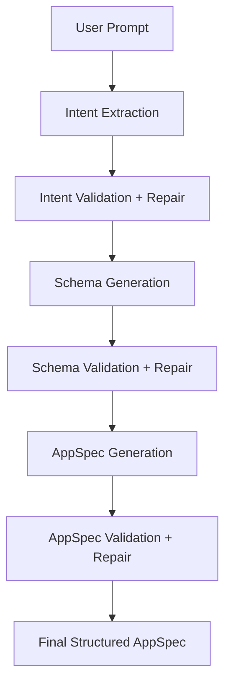

# AppForgeAI

AI Multi-Stage Application Generation Engine. AppForgeAI converts natural-language software requirements into a structured, validated, repairable `AppSpec` for downstream application generation.

It is not a chatbot wrapper. The core system is a staged planning pipeline with provider routing, validation after every stage, deterministic repair, integration registry checks, SSE progress events, cost/latency telemetry, and reproducible evaluation logs.

## Setup Under 5 Minutes

```bash
npm install
cp .env.example .env.local
npm run dev
```

Open `http://localhost:3000`.

The app runs without API keys by using deterministic local planning. Add provider keys to enable live AI routing.

## Pipeline Flow



## Architecture

- `src/lib/pipeline/orchestrator.ts` coordinates stage execution, SSE events, validation, repair, telemetry, and fallback.
- `src/lib/gateway/provider-gateway.ts` implements provider abstraction and routing for OpenAI, Anthropic, Groq, Gemini/Google AI, DeepSeek, OpenRouter, and Mistral.
- `src/lib/validation/*` contains Zod contract validation plus domain rules for schema, API, auth, integrations, and workflows.
- `src/lib/repair/*` contains structural, field, and consistency repair strategies.
- `src/lib/integrations/registry.ts` is the integration source of truth.
- `src/lib/db/store.ts` provides in-memory and optional PostgreSQL stores.
- `src/app/api/*` exposes generation, polling, SSE stream, repair, and integrations endpoints.

## API Endpoints

- `POST /api/generate`
- `GET /api/generate/:jobId`
- `GET /api/generate/:jobId/stream`
- `POST /api/generate/:jobId/repair`
- `GET /api/integrations`

SSE event names:

- `stage_start`
- `stage_complete`
- `stage_failed`
- `generation_complete`

The stream replays persisted events on reconnect.

## Validation Strategy

Validation runs after every stage and never throws. It returns structured errors with:

- `code`
- `stage`
- `path`
- `message`
- `severity`
- `suggestedFix`

Validation layers include:

- Zod JSON contracts for `AppIntent`, `DataSchema`, `AppSpec`, and integrations
- required fields and non-empty structural checks
- snake_case table names
- mandatory `tenant_id`
- field type validity
- primary key existence
- relation target validity
- bidirectional relation consistency
- page to API consistency
- auth role consistency
- integration trigger/action validity
- workflow entity references

## Repair Strategy

Repair runs in priority order:

1. Structural repair: JSON cleanup, missing top-level defaults, empty field defaults
2. Field repair: field types, tenant fields, primary keys, duplicate names, dangling schema references
3. Consistency repair: page/API/entity mismatches, auth roles, invalid integration hooks, workflow references

Every repair log includes strategy, input error, outcome, timestamp, and before/after values when available.

## Provider Routing

Routing is config-driven through `src/lib/gateway/config.ts` and environment overrides.

Default shape:

- intent extraction: fast/cheap primary, Groq fallback, OpenRouter escalation
- schema generation: high-reasoning primary, OpenAI fallback, OpenRouter escalation
- AppSpec generation: high-reasoning primary, Gemini fallback, OpenRouter escalation
- repair: cheap primary, Anthropic fallback, OpenRouter escalation

Actual provider integrations are implemented for:

- OpenAI
- Anthropic
- Groq
- Gemini / Google AI
- OpenRouter
- Mistral
- DeepSeek

Costs are estimated through `COST_TABLE`.

## Integration Registry

Implemented integrations:

- Slack
- WhatsApp
- Gmail
- Google Sheets
- Stripe
- Jira
- Webhook

Each registry item defines `id`, `displayName`, `authType`, triggers, and actions. AppSpec integration hooks are validated against this registry.

## Environment Variables

See `.env.example`.

Important variables:

- `OPENAI_API_KEY`
- `ANTHROPIC_API_KEY`
- `GROQ_API_KEY`
- `GEMINI_API_KEY` or `GOOGLE_API_KEY`
- `OPENROUTER_API_KEY`
- `MISTRAL_API_KEY`
- `DEEPSEEK_API_KEY`
- `DATABASE_URL`
- `APPFORGE_FORCE_LOCAL`
- `APPFORGE_ALLOW_LOCAL_FALLBACK`

## Evaluation

Run:

```bash
npm run evaluate
```

Outputs:

- `evaluation/evaluation-log.json`
- `evaluation/summary.md`

Current deterministic suite result: 5/5 successful, 5/5 integration detection.

## Deployment

```bash
npm run lint
npm run build
```

Deploy to Vercel with environment variables configured. For durable jobs and SSE event replay across instances, set `DATABASE_URL` to PostgreSQL or Supabase Postgres.

## Known Limitations

- In-memory storage is only suitable for local development or single-instance demos.
- Long-running background generation in serverless environments should be paired with durable queues or Vercel background execution primitives for high-volume production.
- Provider pricing changes over time; update `COST_TABLE` before cost-sensitive production use.
- The deterministic planner is a reliable fallback, not a replacement for provider-backed reasoning.

## Future Improvements

- Queue-backed job runner
- Postgres migrations instead of auto-create DDL
- AppSpec export/versioning
- Provider health dashboard
- More evaluation prompts with golden AppSpec assertions
- Optional code generation target from the final AppSpec
