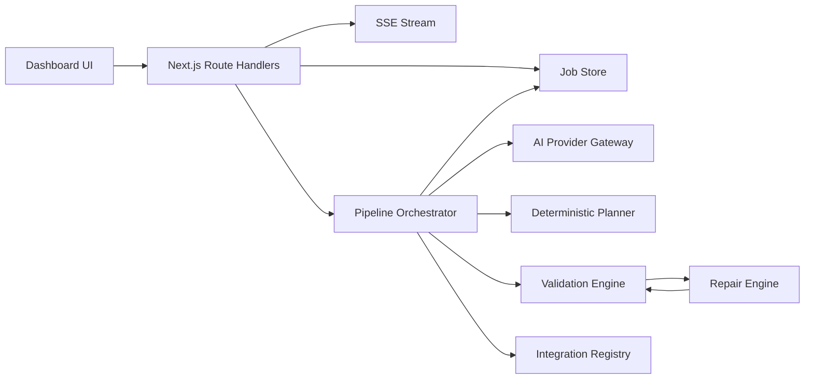

# Architecture

AppForgeAI is organized as a staged AI planning system. The product surface is a Next.js dashboard, but the core value is the server-side planning pipeline.

## System Components

## Pipeline Stages

1. Intent extraction produces `AppIntent`.
2. Schema generation produces `DataSchema`.
3. AppSpec generation produces the final `AppSpec`.

Every stage emits SSE events and is validated before the next stage runs.

## Provider Gateway

The gateway normalizes completion calls across providers:

- OpenAI SDK
- Anthropic SDK
- Groq SDK
- Google GenAI SDK
- OpenRouter HTTP
- Mistral HTTP
- DeepSeek HTTP

Routing is central and environment-overridable. Stage code receives only a `completeAI` function and does not hardcode provider/model names.

## Data and Storage

`JobStore` abstracts persistence. The default is in-memory storage. If `DATABASE_URL` is present, `PostgresJobStore` persists:

- jobs
- AppSpecs
- stage outputs
- validation errors
- repair logs
- provider usage
- SSE event replay records

## Validation

Validation combines Zod contracts and domain-specific rules. It is deliberately strict around cross references because the output is intended for downstream code generation.

## Repair

Repair is deterministic first. AI retry/escalation belongs to the provider/stage execution path; local repair handles known structural and consistency failures without spending model tokens.

## Frontend

The dashboard is not a landing page. It exposes the operational system:

- prompt input
- stage progress
- latency/cost
- readable AppSpec sections
- validation panel
- repair panel
- integration registry
- secondary assistant explanation panel
